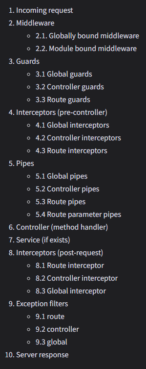

# NestJS Session 3: Middleware, Interceptors & Pipes

## Theory Phase

### Part 1: The Request Lifecycle

#### The Big Picture

Understanding how a request flows through a NestJS application is crucial. When a request hits your server, it passes through several layers before reaching your controller handler, and then flows back out.

**The Sequence:**

1.  **Incoming Request**
2.  **Middleware** (Global -> Module)
3.  **Guards** (Global -> Controller -> Route)
4.  **Interceptors** (Pre-Controller logic)
5.  **Pipes** (Transformation/Validation)
6.  **Controller Handler** (Your business logic)
7.  **Interceptors** (Post-Controller logic)
8.  **Exception Filters** (If error occurs)
9.  **Server Response**



---

### Part 2: Middleware

#### What is Middleware?

-   Functions that run **before** the route handler.
-   Same as Express middleware.
-   Have access to `request`, `response`, and `next()` function.

#### Capabilities

-   Execute code.
-   Make changes to the request and response objects.
-   End the request-response cycle.
-   Call the next middleware function.

#### Use Cases

-   Logging requests (method, URL, duration).
-   Body parsing (json, urlencoded).
-   Rate limiting.
-   Header manipulation (CORS, security headers).

```typescript
@Injectable()
export class LoggerMiddleware implements NestMiddleware {
	use(req: Request, res: Response, next: NextFunction) {
		console.log("Request...");
		next();
	}
}
```

---

### Part 3: Guards

#### What are Guards?

-   Classes annotated with `@Injectable()` implementing `CanActivate`.
-   Single responsibility: **Authorization**.
-   Determine if a request should be handled by the route handler.

#### Why Guards vs Middleware?

-   Middleware doesn't know _which_ handler will be executed.
-   Guards have access to the `ExecutionContext` and know exactly what's going to be executed next.

#### Use Cases

-   Authentication (Is the user logged in?).
-   Authorization (Does the user have the 'admin' role?).
-   API Key validation.

```typescript
@Injectable()
export class AuthGuard implements CanActivate {
	canActivate(context: ExecutionContext): boolean {
		const request = context.switchToHttp().getRequest();
		return validateRequest(request);
	}
}
```

---

### Part 4: Interceptors

#### What are Interceptors?

-   Classes annotated with `@Injectable()` implementing `NestInterceptor`.
-   Inspired by Aspect-Oriented Programming (AOP).
-   Wrap the execution of the route handler.

#### Capabilities

-   Bind extra logic before/after method execution.
-   Transform the result returned from a function.
-   Transform the exception thrown from a function.
-   Extend basic function behavior.
-   Completely override a function (e.g., for caching).

#### Use Cases

-   **Response Mapping**: Wrapping data in `{ data: ... }`.
-   **Logging**: Measuring execution time.
-   **Caching**: Returning cached responses.
-   **Timeout**: Canceling long-running requests.

```typescript
@Injectable()
export class LoggingInterceptor implements NestInterceptor {
	intercept(context: ExecutionContext, next: CallHandler): Observable<any> {
		const now = Date.now();
		return next
			.handle()
			.pipe(tap(() => console.log(`After... ${Date.now() - now}ms`)));
	}
}
```

---

### Part 5: Pipes

#### What are Pipes?

-   Classes annotated with `@Injectable()` implementing `PipeTransform`.
-   Operate on the **arguments** of the route handler.

#### Two Main Roles

1.  **Transformation**: Transform input data to the desired form (e.g., string "1" to number 1).
2.  **Validation**: Evaluate input data and throw an exception if invalid.

#### Built-in Pipes

-   `ValidationPipe`
-   `ParseIntPipe`
-   `ParseBoolPipe`
-   `ParseArrayPipe`
-   `ParseUUIDPipe`

#### Use Cases

-   Validating DTOs (Data Transfer Objects).
-   Converting path parameters to numbers/booleans.
-   Setting default values.

```typescript
@Get(':id')
findOne(@Param('id', ParseIntPipe) id: number) {
  return this.catsService.findOne(id);
}
```

---

### Part 6: Exception Filters

#### What are Exception Filters?

-   Classes annotated with `@Catch()` implementing `ExceptionFilter`.
-   Responsible for processing all unhandled exceptions across your application.

#### How it Works

-   When your code throws an exception (e.g., `HttpException`), the filter catches it.
-   It allows you to control the exact response sent back to the client.

#### Use Cases

-   Customizing error response structure.
-   Logging errors to an external service.
-   Handling specific database errors.

```typescript
@Catch(HttpException)
export class HttpExceptionFilter implements ExceptionFilter {
	catch(exception: HttpException, host: ArgumentsHost) {
		const ctx = host.switchToHttp();
		const response = ctx.getResponse<Response>();
		const status = exception.getStatus();

		response.status(status).json({
			statusCode: status,
			timestamp: new Date().toISOString(),
			path: ctx.getRequest<Request>().url,
		});
	}
}
```

---

## Hands-on Phase

### Project: Enhance Task Manager API

We will take the Task Manager API from Session 2 and add advanced features.

---

### Exercise 1: Implement Logger Middleware

#### Goal

Create a middleware that logs every incoming request with its method, URL, and timestamp.

#### Steps

1.  Generate middleware: `nest g middleware common/middleware/logging`
2.  Implement `use` method to log `req.method`, `req.originalUrl`, and `Date.now()`.
3.  Calculate request duration by hooking into `res.on('finish')`.
4.  Apply middleware in `AppModule` using `configure(consumer: MiddlewareConsumer)`.

---

### Exercise 2: Create an API Key Guard

#### Goal

Protect specific routes so they can only be accessed with a valid API Key in the headers.

#### Steps

1.  Generate guard: `nest g guard common/guards/api-key`
2.  Implement `canActivate`.
3.  Check for a header `x-api-key`.
4.  Validate it against a hardcoded value (e.g., "secret-123").
5.  Apply the guard to the `createTask` and `deleteTask` endpoints using `@UseGuards()`.
6.  Test with and without the header.

---

### Exercise 3: Response Transform Interceptor

#### Goal

Standardize all API responses to follow a specific format: `{ data: ..., meta: ... }`.

#### Steps

1.  Generate interceptor: `nest g interceptor common/interceptors/transform`
2.  Implement `intercept` method.
3.  Use RxJS `map` operator to wrap the response data.
4.  Format: `{ statusCode: number, data: T, timestamp: string }`.
5.  Apply globally in `main.ts` using `app.useGlobalInterceptors()`.

---

### Exercise 4: Custom Parse ID Pipe

#### Goal

Create a pipe that validates if an ID is a valid UUID and throws a custom error if not.

#### Steps

1.  Generate pipe: `nest g pipe common/pipes/parse-id`
2.  Implement `transform` method.
3.  Check if value is a valid UUID (use `uuid` library or regex).
4.  If invalid, throw `BadRequestException` with message "Invalid UUID format".
5.  Apply to `getTaskById` and `deleteTask` routes.

---

### Exercise 5: Global Exception Filter

#### Goal

Create a filter to catch all `HttpException`s and return a friendly JSON error response.

#### Steps

1.  Generate filter: `nest g filter common/filters/http-exception`
2.  Implement `catch` method.
3.  Extract status and message from exception.
4.  Return JSON: `{ success: false, error: message, statusCode: status, timestamp: date }`.
5.  Apply globally in `main.ts` using `app.useGlobalFilters()`.

---

## Testing Your Enhancements

### 1. Test Middleware

-   Make any request.
-   Check server console for logs: `[GET] /tasks - 15ms`.

### 2. Test Guard

-   Try `POST /tasks` without header -> **401 Forbidden**.
-   Try `POST /tasks` with `x-api-key: secret-123` -> **201 Created**.

### 3. Test Interceptor

-   `GET /tasks` should return:
    ```json
    {
      "statusCode": 200,
      "data": [...],
      "timestamp": "..."
    }
    ```

### 4. Test Pipe

-   `GET /tasks/invalid-id` -> **400 Bad Request** "Invalid UUID format".

### 5. Test Filter

-   Trigger an error (e.g., 404).
-   Response should match your custom error format.

---

## Key Takeaways

By the end of this session, you should understand:

-   The full lifecycle of a NestJS request.
-   How to intercept and modify requests with **Middleware**.
-   How to secure endpoints with **Guards**.
-   How to transform responses and handle cross-cutting concerns with **Interceptors**.
-   How to validate and transform data with **Pipes**.
-   How to handle errors gracefully with **Exception Filters**.

---

## Resources

-   [NestJS Middleware](https://docs.nestjs.com/middleware)
-   [NestJS Guards](https://docs.nestjs.com/guards)
-   [NestJS Interceptors](https://docs.nestjs.com/interceptors)
-   [NestJS Pipes](https://docs.nestjs.com/pipes)
-   [NestJS Exception Filters](https://docs.nestjs.com/exception-filters)
-   [Video Reference](https://youtu.be/x1W3FJ1RJlM)
-   [Request Life Cycle](https://github.com/ahsanatta96/nestjs-request-response-cycle/blob/main/summary.md)
