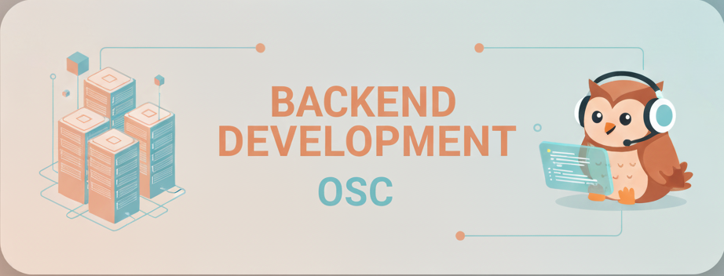

<div align="center">

  
  

   [](https://nodejs.org/)
   [](https://www.typescriptlang.org/)
   [](https://www.javascript.com/)
     
   [](https://github.com/YOUR-USERNAME/backend-mastery-roadmap)
   [](CONTRIBUTING.md)

</div>

---
## Table of Content

-   [About This Repository ](#-about-this-repository)
-   [What You'll Learn](#What-You'll-Learn)
-   [Level 1 Outline](#-level-1-backend-fundamentals-12-sessions)
-   [Level 2 Outline](#-level-2-advanced-backend-18-sessions)
-   [Repo Structure](#Repository-Structure)
-   [Get Started](#-getting-started)
-   [Contributing](#-contributing)
-   [Resouces](#-recommended-resources--extra-resourcesmd)


## 📖 About This Repository

* Welcome to the **backend-learning-hub-26** ! 
* This repository is your complete guide to becoming a professional backend developer. 
* Designed for our college's **OSC ASU** student activity **Backend Committee**, this curriculum takes you from basics all the way to deploying microservices in production.

---
### 🎯 What You'll Learn

- **Level 1**: Core backend fundamentals, databases, authentication, and deployment
- **Level 2**: Advanced topics including NestJS, system design, microservices, and Docker

---
### 📘 Level 1: Backend Fundamentals (12 Sessions)

| Session | Topic |
|---------|-------|
| 01 | JavaScript vs TypeScript + TypeScript Basics|
| 02 | More TypeScript |
| 03 | Advanced TypeScript | 
| 04 | Networking + Node.js |
| 05 | Express + Node.js | 
| 06 | Express Deep Dive | 
| 07 | SQL Databases | 
| 08 | NoSQL Databases | 
| 09 | Logging, Errors & Architecture | 
| 10 | Authentication & Security | 
| 11 | Advanced Auth & Cybersecurity | 
| 12 | Deployment, Docs & Integration | 
---
### 📗 Level 2: Advanced Backend (18 Sessions)

| Session | Topic |
|---------|-------|
| 01-04 | NestJS Framework | 
| 05-08 | Advanced Databases |
| 09 | Caching Strategies | 
| 10 | File Uploads & Storage | 
| 11 | WebSockets & Webhooks | 
| 12 | Testing Strategies | 
| 13 | Cybersecurity Practices | 
| 14 | System Design & Architecture | 
| 15 | Microservices Architecture | 
| 16 | Docker & Containerization | 
| 17 | Performance Optimization | 
| 18 | Git Workflows & Collaboration | 

---

## 📂 Repository Structure

```
backend-mastery-roadmap/
```
```
├── 📁 Welcome!               
    ├──> Session_0
    │    ├── session_0.pdf
    │    ├── session_0.pptx
    │ 
    └──> How_To_Get_Started
```
```
├── 📁 Level-1                # Level 1 Sessions
    ├──> Session-1
    │    ├── Theory        # Theoratical concepts
    │    ├── Tech          # Tools & technologies
    │    ├── Code          # Cumulative project
    └──> Session-2...
```
```
├── 📁 Level-2                # Level 2 Sessions
    ├──> Session-1
    │    ├── Theory.md        # Theoratical concepts
    │    ├── Code.md          # Cumulative project
    │    ├── Tech.md          # Tools & technologies
    └──> Session-2...
```

```
├── 📁 More             
    ├──> Assets
    │      
    └──> Best_Practices
    │      
    └──> Chanllenges
    │      
    └──> Problem_Solving
    │      
    └──> extra_resources
```
---

## 🚀 Getting Started

* Please Read This File [How_To_Get_Started.md](Welcome!/How_To_Get_Started/)

---
 
## 🤝 Contributing

We welcome contributions! Here's how you can help:

1. **Report Issues** - Found a bug or typo? Let us know!
2. **Suggest Improvements** - Have ideas? Open an issue!
3. **Submit PRs** - Want to contribute content? Follow our guidelines!
4. **Share Resources** - Found helpful materials? Share them!

See [CONTRIBUTING.md](More/contributing.md) for detailed guidelines.

---

### 📚 Recommended Resources  [Extra-Resources.md](More/extra_resources.md)


