<div align="center">
  
  
  <h1>🚀 Backend Mastery Roadmap</h1>
  <p>A comprehensive journey from JavaScript fundamentals to production-ready microservices</p>
  
  
  [](https://opensource.org/licenses/MIT)
  [](CONTRIBUTING.md)
  
  
  
  
  [](https://nodejs.org/)
  [](https://www.typescriptlang.org/)
  [](https://www.javascript.com/)
  
  [](https://github.com/YOUR-USERNAME/backend-mastery-roadmap)
  [](CONTRIBUTING.md)
  

</div>

---

## 📖 About This Repository

Welcome to the **Backend Mastery Roadmap**! This repository is your complete guide to becoming a professional backend developer. Designed for our college's student activity backend track, this curriculum takes you from JavaScript basics all the way to deploying microservices in production.

### 🎯 What You'll Learn

- **Level 1**: Core backend fundamentals, databases, authentication, and deployment
- **Level 2**: Advanced topics including NestJS, system design, microservices, and Docker

### 🌟 Why This Repository?

- ✅ **Structured Learning Path** - 30 comprehensive sessions
- ✅ **Theory + Practice** - Every session includes theory, tech stack, and code examples
- ✅ **Real Projects** - Build actual applications as you learn
- ✅ **Industry Standards** - Learn practices used in production environments
- ✅ **Community Driven** - Learn together, grow together

---

## 🗺️ Learning Path Overview

### 📘 Level 1: Backend Fundamentals (12 Sessions)

| Session | Topic | Duration | Status |
|---------|-------|----------|--------|
| 01 | JavaScript Basics | 2 weeks | 🟢 Ready |
| 02 | JavaScript + TypeScript | 2 weeks | 🟡 In Progress |
| 03 | Advanced JS + TS | 2 weeks | ⚪ Planned |
| 04 | Networking + Node.js | 2 weeks | ⚪ Planned |
| 05 | Express + Node.js | 2 weeks | ⚪ Planned |
| 06 | Express Deep Dive | 2 weeks | ⚪ Planned |
| 07 | SQL Databases | 2 weeks | ⚪ Planned |
| 08 | NoSQL Databases | 2 weeks | ⚪ Planned |
| 09 | Logging, Errors & Architecture | 2 weeks | ⚪ Planned |
| 10 | Authentication & Security | 2 weeks | ⚪ Planned |
| 11 | Advanced Auth & Cybersecurity | 2 weeks | ⚪ Planned |
| 12 | Deployment, Docs & Integration | 2 weeks | ⚪ Planned |

### 📗 Level 2: Advanced Backend (18 Sessions)

| Session | Topic | Duration | Status |
|---------|-------|----------|--------|
| 01-04 | NestJS Framework | 8 weeks | ⚪ Planned |
| 05-08 | Advanced Databases | 8 weeks | ⚪ Planned |
| 09 | Caching Strategies | 2 weeks | ⚪ Planned |
| 10 | File Uploads & Storage | 2 weeks | ⚪ Planned |
| 11 | WebSockets & Webhooks | 2 weeks | ⚪ Planned |
| 12 | Testing Strategies | 2 weeks | ⚪ Planned |
| 13 | Cybersecurity Practices | 2 weeks | ⚪ Planned |
| 14 | System Design & Architecture | 2 weeks | ⚪ Planned |
| 15 | Microservices Architecture | 2 weeks | ⚪ Planned |
| 16 | Docker & Containerization | 2 weeks | ⚪ Planned |
| 17 | Performance Optimization | 2 weeks | ⚪ Planned |
| 18 | Git Workflows & Collaboration | 2 weeks | ⚪ Planned |

---

## 🗺️ Visual Learning Path

```mermaid
graph LR
    A[JavaScript Basics] --> B[TypeScript]
    B --> C[Node.js & Express]
    C --> D[Databases SQL & NoSQL]
    D --> E[Auth & Security]
    E --> F[Deployment]
    F --> G[Level 1 Complete!]
    
    G --> H[NestJS Framework]
    H --> I[Advanced Databases]
    I --> J[Caching & Performance]
    J --> K[System Design]
    K --> L[Microservices]
    L --> M[Docker & DevOps]
    M --> N[Backend Master! 🎉]
    
    style A fill:#4CAF50
    style G fill:#FF9800
    style N fill:#F44336
```


---
## 📂 Repository Structure

```
backend-mastery-roadmap/
├── 📁 level-1/                    # Level 1 Sessions
│   ├── session-01-javascript-basics/
│   │   ├── README.md              # Session overview
│   │   ├── theory.md              # Theoretical concepts
│   │   ├── tech-stack.md          # Tools & technologies
│   │   ├── code-examples.md       # Code demonstrations
│   │   ├── exercises.md           # Practice problems
│   │   ├── solutions.md           # Exercise solutions
│   │   └── resources.md           # Additional learning materials
│   └── session-02...
│
├── 📁 level-2/                    # Level 2 Sessions
│   ├── session-01-nestjs-fundamentals/
│   └── session-02...
│
├── 📁 projects/                   # Hands-on Projects
│   ├── level-1/
│   │   ├── todo-api/
│   │   ├── blog-platform/
│   │   └── ecommerce-backend/
│   └── level-2/
│       ├── social-media-api/
│       └── microservices-app/
│
├── 📁 resources/                  # Learning Resources
│   ├── cheatsheets/              # Quick reference guides
│   ├── tools/                    # Development tools setup
│   └── books/                    # Recommended reading
│
├── 📁 docs/                       # Documentation
│   ├── guides/                   # How-to guides
│   └── resources/                # Additional materials
│
└── 📁 assets/                     # Media files
    ├── images/
    └── diagrams/
```

---

## 🚀 Getting Started

### Prerequisites

Before starting, make sure you have:

- **Node.js** (v18+ recommended) - [Download](https://nodejs.org/)
- **Git** - [Download](https://git-scm.com/)
- **Code Editor** - [VS Code](https://code.visualstudio.com/) recommended
- **Terminal/Command Line** basics

### Your Learning Journey

1. **Start with Level 1, Session 01** - Don't skip sessions!
2. **Read Theory First** - Understand concepts before coding
3. **Follow Code Examples** - Type them out, don't copy-paste
4. **Complete Exercises** - Practice makes perfect
5. **Build Projects** - Apply what you've learned
6. **Review Solutions** - Learn from different approaches

### How to Use This Repository

```bash
# Clone the repository
git clone https://github.com/YOUR-USERNAME/backend-mastery-roadmap.git

# Navigate to the repository
cd backend-mastery-roadmap

# Start with Level 1, Session 01
cd level-1/session-01-javascript-basics

# Read the README to understand the session
cat README.md
```

---

## 🎯 Session Structure

Each session follows this consistent structure:

### 📋 README.md
- Session overview
- Learning objectives
- Prerequisites
- Estimated time to complete

### 📚 theory.md
- Core concepts and principles
- Why these concepts matter
- Real-world applications
- Best practices

### 🛠️ tech-stack.md
- Tools and technologies covered
- Installation guides
- Configuration tips
- Alternative tools

### 💻 code-examples.md
- Practical code demonstrations
- Commented explanations
- Common patterns
- Anti-patterns to avoid

### ✏️ exercises.md
- Hands-on practice problems
- Progressive difficulty
- Real-world scenarios
- Challenge problems

### ✅ solutions.md
- Detailed solutions
- Multiple approaches
- Code explanations
- Performance considerations

### 🔗 resources.md
- Official documentation links
- Video tutorials
- Articles and blog posts
- Community resources

---

## 💡 Projects

Apply your learning through real-world projects:

### Level 1 Projects
- **Todo API** - CRUD operations, authentication
- **Blog Platform** - RESTful API, database integration
- **E-commerce Backend** - Complex business logic

### Level 2 Projects
- **Social Media API** - Real-time features, scalability
- **Microservices Application** - Distributed systems

---

## 🤝 Contributing

We welcome contributions! Here's how you can help:

1. **Report Issues** - Found a bug or typo? Let us know!
2. **Suggest Improvements** - Have ideas? Open an issue!
3. **Submit PRs** - Want to contribute content? Follow our guidelines!
4. **Share Resources** - Found helpful materials? Share them!

See [CONTRIBUTING.md](CONTRIBUTING.md) for detailed guidelines.

---

## 📚 Recommended Resources

### Books
- "Node.js Design Patterns" by Mario Casciaro
- "Designing Data-Intensive Applications" by Martin Kleppmann
- "Clean Code" by Robert C. Martin

### Online Platforms
- [Node.js Official Docs](https://nodejs.org/docs/)
- [MDN Web Docs](https://developer.mozilla.org/)
- [TypeScript Handbook](https://www.typescriptlang.org/docs/)

### YouTube Channels
- Fireship
- Traversy Media
- The Net Ninja

---

## 🏆 Milestones & Achievements

Track your progress:

- [ ] Complete Level 1 (12 sessions)
- [ ] Build first full-stack application
- [ ] Complete Level 2 (18 sessions)
- [ ] Deploy production application
- [ ] Contribute to open-source
- [ ] Master backend development 🎉

---

## 📞 Support & Community

- **Discord Server**: [Join our community](#)
- **Email**: backend-team@college.edu
- **Office Hours**: [Schedule here](#)

---

## 📄 License

This project is licensed under the MIT License - see the [LICENSE](LICENSE) file for details.

---

## 🙏 Acknowledgments

- Our amazing student community
- Contributing instructors and mentors
- Open-source projects that inspire us

---

<div align="center">

### ⭐ Star this repository if you find it helpful!

**Happy Coding! 🚀**

Made with ❤️ by the Backend Team

[Report Bug](https://github.com/YOUR-USERNAME/backend-mastery-roadmap/issues) · [Request Feature](https://github.com/YOUR-USERNAME/backend-mastery-roadmap/issues) · [Ask Question](https://github.com/YOUR-USERNAME/backend-mastery-roadmap/discussions)

</div>
